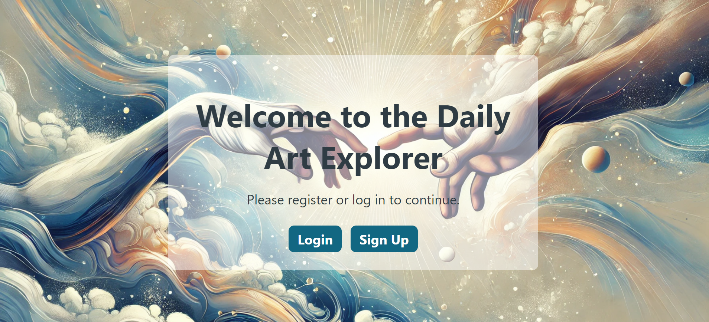
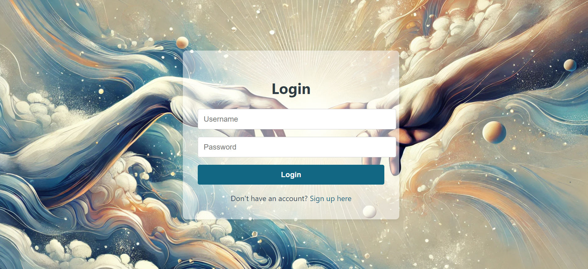
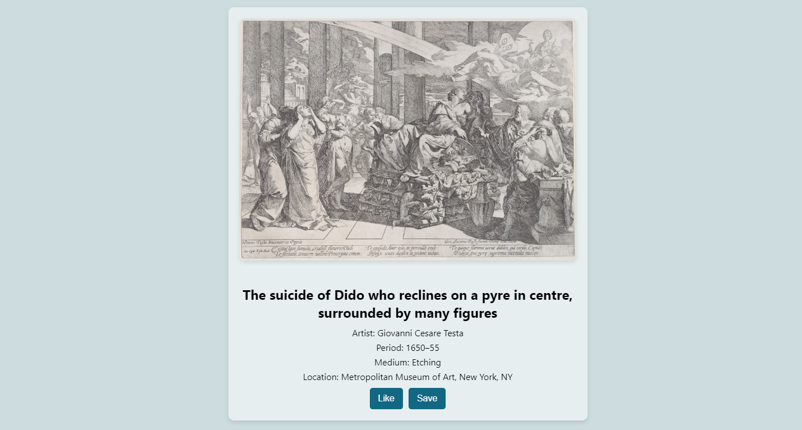

# Daily Art Explorer Website
Daily Art Explorer is an interactive web application designed to allow users to discover, like, save, and share random artworks from the Metropolitan Museum of Art's collection. Built using modern web technologies such as React, Redux, Node.js, PostgreSQL, this application aims to provide a seamless and engaging experience for art enthusiasts.

## The website Link:

* [Daily Art Explorer Website](https://daily-art-explorer-frontend.onrender.com/).

## Key Features
* **User Authentication:** Secure registration and login functionalities with hashed passwords and JWT-based session management.
* **Random Art:** Display a new random artwork from the Met's collection, with an option to fetch a different random artwork.
* **Like and Save Artworks:** Users can like and save their favorite artworks for future reference.
* **Social Media Sharing:** Share artwork on social platforms such as facebook, Twitter, and Whatsapp using React-share.
* **Art Filtering:** Explore artworks based on various criteria such as name, artist, period etc.
* **Persistent Data:** Ensure that liked and saved artworks are stored in the database and persist across sessions.

## Technologies Used
* **Front-End:** React, Redux, JavaScript, HTML, CSS for building a responsive a dynamic user interface.
* **Back-End:** Node.js, Express, PostgreSQL for handling API requests, data storage, and user authentication.
* **Security:** Bcyrpt for password hashing, JWT for secure authentication, HTTPS for secure data transmission.
* **APIs:** Metropolitan Museum of Art API for fetching artwork data.
* **Social Sharing:** React-share library for integrating social media sharing functionality.
* **State Management:** Redux for handling application state and side effects.
* **Axios:** For making API requests.

## Screenshots
**Landing Page:** 

**Login Page:**

**Artwork Display Example:**

## App Features Include
* **User Authentication:**
	* Secure login and registration using JWT tokens.
	* Session management to ensure user data security.
* **Art Exploration:**
	* Display random artworks.
	* Option to view a new artwork.
* **Art Filtering:**
	* filter by name, period, artist, medium etc.
* **Art Saving and Liking:**
	* Like and save artworks for future viewing.
* **Social Media Sharing:**
	* Share artworks directly on popular social media platforms.
## Setup Guide
**Prerequisites:**
Before you begin, ensure you have the following installed on your local machine:

* [Node.js](https://nodejs.org/en/download/)
* [PostgreSQL](https://www.postgresql.org/download/)
* [Git](https://git-scm.com/downloads)

**Step-by-Step Installation:**

1.  **Clone the Repository:**

	### `git clone https://github.com/ozgenur00/daily-art-explorer-main.git`
	### `cd daily-art-explorer`
 
**Backend Setup:**

1. **Navigate to the Backend Folder:**
	### `cd backend`

2. **Install Backend Dependencies:**
	### `npm install`

3. **Set Up PostgreSQL Database:**
	### `CREATE DATABASE daily_art_explorer;`

4. **Once the database is created, connect to it:**
	### `\connect daily_art_explorer;`

5. **Run the SQL setup script to create the tables and relationships:**
	### `\i ./daily-art-explorer.sql`

6. **Start the backend Server:**
	### `npm start`

The backend will start running on [http://localhost:5000](http://localhost:5000) by default.

7. **Running Backend Tests:**

	### `npm test`

**Frontend Setup:**

8. **Navigate to the Frontend Folder:**
	### `cd ../frontend`

9. **Install Frontend Dependencies:**
	### `npm install`
10. **Run the Frontend Application:**
	### `npm start`

The frontend will start on [http://localhost:3000](http://localhost:3000).

11. **Running Frontend Tests:**

	### `npm test`

## **Available Scripts**

### `npm start`

Starts the app in development mode.

* Frontend: [http://localhost:3000](http://localhost:3000) 
* Backend: [http://localhost:5000](http://localhost:5000)

### `npm test`
Launches the test runner in interactive watch mode.

### `npm run build  (Frontend Only)`
Builds the frontend app for production.

## Conclusion

Daily Art Explorer is a comprehensive platform that allow users to explore, like, save and share art daily. With a focus on delivering a rich user experience backend by secure and scalable technologies, this website serves as an engaging resource for art enthusiasts everywhere.

