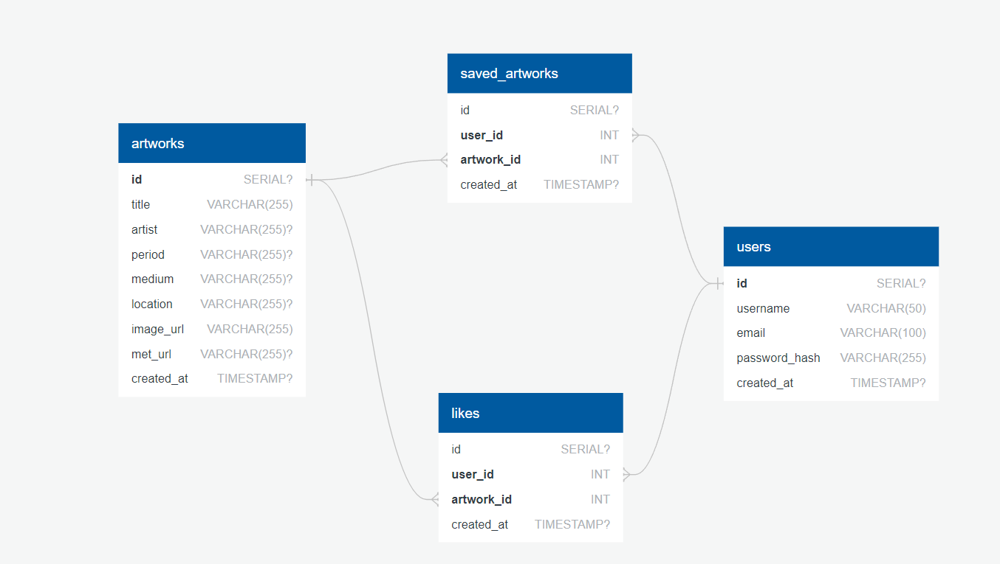

## Project Proposal: Daily Art Explorer Website

**Summary**

The project aims to create a Daily Art Explorer Website that allows users to discover random art pieces from the Metropolitan Museum of Art’s collection daily. Utilizing a technology stack that includes HTML, CSS, JavaScript, React, Redux, Node.js, Express, and PostgreSQL, this application will provide functionalities such as liking, saving, sharing on social media, and filtering artworks by various criteria. The website will prioritize user experience, seamless interaction, and data accuracy, ensuring an engaging platform for art enthusiasts.

**Objectives**

• Develop a user-friendly web application for daily art exploration.
• Enable users to like, save, and share artworks on social media.
• Provide filtering options to explore art based on various criteria.
• Utilize PostgreSQL and RESTful API for efficient data management and scalability.

**Target Audience**

Art enthusiasts, students, and professionals looking for an engaging and interactive way to explore and discover artworks from the Metropolitan Museum of Art.

**Key Features**

1. **User Authentication:** Secure user login with hashed passwords and session management.
2. **Daily Random Art:** Display a new random artwork from the Met’s collection and function to get a new random artwork.
3. **Like and Save:** Allow users to like and save their favorite artworks for future reference.
4. **Social Media Sharing:** Enable users to share artwork on social media platforms like Facebook, Twitter, and Whatsapp.
5. **Filtering:** Allow users to filter artworks.
6. **Data Persistence:** Ensure liked and saved artworks are stored in the database and persist across sessions.

**Technology Stack**

• **Front-End:** HTML, CSS, JavaScript, React, Redux for building the user interface and managing state.

• **Back-End:** Node.js with Express as the web server framework, using RESTful APIs for data handling.
• Database: PostgreSQL for data storage, offering advanced features and scalability.
• Security: bcrypt for password hashing, JWT for secure authentication, and HTTPS for secure data transmission.

**APIs and Libraries**

• **Metropolitan Museum of Art API:** Used to fetch data and images of artworks.

**React-Share:** Used for integrating social media sharing functionalities.

• **Axios:*** Used for making API calls.

• **Redux:** Used for managing the application’s state.

• **bcrypt:** Used for hashing passwords.

• **JWT:** Used for secure authentication and authorization.

**Development Plan**

**Setup:**
Configure the initial React application structure.
Set up the Node.js backend with Express and PostgreSQL database.
Implement user authentication using JWT.

**Front-End Development:**
Design a responsive and intuitive interface using React and CSS.
Integrate Redux for state management.
Implement daily random art display functionality.

**Back-End Development**:
Set up RESTful API routes for fetching, liking, saving, and filtering artworks.
Implement logic for handling user interactions and storing data in PostgreSQL.
Ensure secure data handling and user authentication.

**Social Media Integration:**
Integrate react-share library for social media sharing.
Implement sharing functionalities and ensure proper metadata tagging for social platforms.

**Testing and Debugging:**
Write tests for front-end components and back-end routes.
Conduct extensive testing to ensure reliability and security.
Debug and fix any issues identified during testing.

**Deployment:**
Prepare the project for deployment.
Deploy the application on Render using Supabase for the database.
Conduct post-deployment testing and fixes.

**Challenges and Solutions**

**Data Accuracy and Integrity:** Ensure accurate data fetching and display through thorough testing and API error handling.

**Security and Privacy:** Utilize encryption, secure session management, and best practices to protect user data.

**User Engagement:** Design an engaging user interface and provide useful filtering and sharing functionalities to encourage regular use.

**Conclusion**

By focusing on seamless user interaction supported by robust technologies like React, Node.js, and PostgreSQL, the Daily Art Explorer Website will offer a powerful and engaging platform for art enthusiasts to explore and discover artworks. Through careful development and attention to user experience, security, and functionality, this project will deliver a valuable resource for daily art exploration.

——————————————————————————————————————————

**DATABASE SCHEMA**

**Relationships**

**One-to-Many Relationship between users and likes:** One user can like many artworks.

**One-to-Many Relationship between users and saved_artworks:** One user can save many artworks.

**One-to-Many Relationship between artworks and likes:** One artwork can be liked by many users.

**One-to-Many Relationship between artworks and saved_artworks:** One artwork can be saved by many users.

